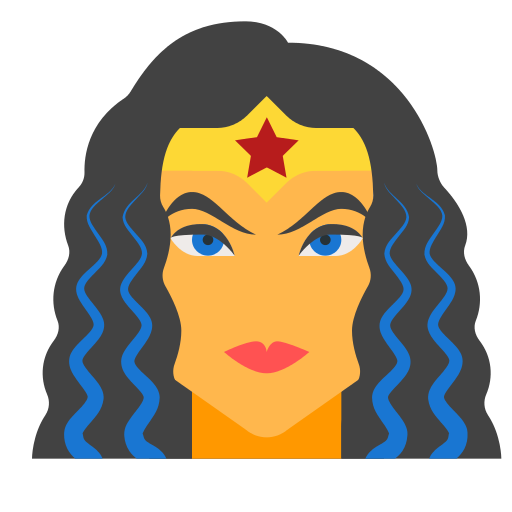

<div align="center">

</div>

```js
  {
    Saudação: 'Olá',
    Nome: 'Letícia Castro',
    Status: 'Estudande de Desenvolvimento Web na Trybe',
    Stacks: [
      FrontEnd: {
        React,
        Redux,
        HTML,
        CSS
      },
      Back-End: {
        MongoDB,
        MySQL,
        Node,
      },
    ],
    Hobbies: [ 'Games', 'Colecionar', 'Ler', 'Ouvir Música'],
  }
```

<div>
  
  
</div>
